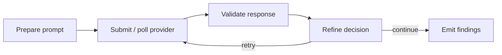

# Flower JVM AI Harness

Flower JVM AI Harness is a Java 21 framework for turning one AI-dependent task
into a controlled, testable Flower workflow.

It standardizes the work around a model or agent execution:

- non-blocking submission and polling;
- structured output validation;
- retry, prompt refinement, and model fallback;
- cancellation, attempt budgets, and concurrency limits;
- operational run snapshots and recovery policy;
- generic findings and host publication seams;
- deterministic tests without live provider calls.

```text
Provider SDK / Spring AI / internal service / agent runner
  = executes AI work

Flower
  = executes flows and steps

flower-ai-harness
  = controls and validates one AI business task

Your application
  = owns domain data, prompts, persistence, UI, audit, and orchestration
```

The project is not a general autonomous-agent framework, RAG platform,
workflow-engine replacement, or domain-specific document library.

## How it works

A host application defines an `AiHarnessSpec<I, T>` containing:

- a prompt builder;
- a default model and provider options;
- a validator for structured output type `T`;
- a retry/refine policy;
- a finding extractor and sink;
- optional budget, resource, run-store, cancellation, and trace controls.

`AiHarnessFlowFactory<I, T>` builds a Flower flow with this lifecycle:



Long-running provider work stays behind `AiModelGateway` and `AiModelCall`.
Flower worker ticks only submit, poll, and react.

## Modules

| Artifact | Purpose |
| --- | --- |
| `flower-ai-harness-core` | Lifecycle, gateway contracts, policies, state, flow factory. |
| `flower-ai-harness-validator-jackson` | Jackson structured-output validation. |
| `flower-ai-harness-test` | Fake gateway and deterministic harness test support. |
| `flower-ai-harness-spring-ai` | Spring AI gateway adapter. |
| `flower-ai-harness-provider-agent-cli` | External Codex, Claude, or custom agent runner adapter. |
| `flower-ai-harness-provider-openai-compatible` | OpenAI-compatible `/chat/completions` adapter. |
| `flower-ai-harness-provider-openai` | Official OpenAI Java SDK adapter. |
| `flower-ai-harness-provider-anthropic` | Official Anthropic Java SDK adapter. |
| `flower-ai-harness-spring-boot-starter` | Thin Spring Boot auto-configuration. |
| `flower-ai-harness-samples` | Text review sample and end-to-end scenarios. |

See [`docs/MODULES.md`](docs/MODULES.md) for dependency graphs, public entry
points, and module-selection guidance.

## Maven dependency

All deployable modules use group:

```text
io.github.flowerjvm
```

Example:

```xml
<dependency>
  <groupId>io.github.flowerjvm</groupId>
  <artifactId>flower-ai-harness-core</artifactId>
  <version>0.1.1</version>
</dependency>
```

Most structured-output applications also use:

```xml
<dependency>
  <groupId>io.github.flowerjvm</groupId>
  <artifactId>flower-ai-harness-validator-jackson</artifactId>
  <version>0.1.1</version>
</dependency>
```

Add one production provider module and use
`flower-ai-harness-test` in test scope.

## Example shape

```java
AiHarnessSpec<ReviewInput, ReviewDraft> spec =
    AiHarnessSpec.<ReviewInput, ReviewDraft>builder()
        .harnessId("text-review")
        .defaultModelId(ModelId.parse("anthropic:claude-model"))
        .promptVersion(new PromptVersion("text-review", "1.0.0"))
        .promptBuilder(reviewPromptBuilder)
        .validator(reviewValidator)
        .refinePolicy(new MaxAttemptsRefinePolicy(3))
        .findingExtractor(reviewFindingExtractor)
        .findingSink(reviewFindingSink)
        .build();

AiHarnessFlowFactory<ReviewInput, ReviewDraft> factory =
    new AiHarnessFlowFactory<>(gateway, spec, AiHarnessClock.system());

AiHarnessFlow run = factory.createFlow(input);
worker.submit(run.flow());
```

The host owns the Flower `Engine`/`Worker` lifecycle and observes
`run.context()` for run identity and state.

## Documentation

Start here:

- [`AGENTS.md`](AGENTS.md) — repository entry point for agents and
  contributors.
- [`docs/README.md`](docs/README.md) — documentation map.
- [`docs/PROJECT_OVERVIEW.md`](docs/PROJECT_OVERVIEW.md) — concept and scope.
- [`docs/ARCHITECTURE.md`](docs/ARCHITECTURE.md) — current runtime design.
- [`docs/MODULES.md`](docs/MODULES.md) — module catalog.
- [`docs/IMPLEMENTATION_STATUS.md`](docs/IMPLEMENTATION_STATUS.md) — current
  implemented and pending work.
- [`docs/DEVELOPMENT.md`](docs/DEVELOPMENT.md) — build and change workflow.
- [`docs/AGENT_CLI_PROVIDER.md`](docs/AGENT_CLI_PROVIDER.md) — external agent
  runner contract, security, and operations.

Historical v0 design records are preserved under
[`docs/archive/`](docs/archive/), but they are not current specifications.

## Current status

- Latest repository release tag: `v0.1.1`.
- Current release version: `0.1.1`.
- APIs are pre-1.0 and may change between minor releases.
- The vendor-neutral CLI/subprocess agent provider is implemented in the
  current development line.

See [`docs/AGENT_CLI_PROVIDER.md`](docs/AGENT_CLI_PROVIDER.md).

## Build

```bash
mvn -B -ntp clean verify
```

Run the sample tests:

```bash
mvn -B -ntp -pl flower-ai-harness-samples -am test
```

Release procedure:

[`docs/RELEASING.md`](docs/RELEASING.md)

## Related repositories

- [Flower runtime](https://github.com/flowerjvm/flower)
- [AI Harness](https://github.com/flowerjvm/flower-ai-harness)
- [Bloom event bus](https://github.com/flowerjvm/bloom)
- [Flower samples](https://github.com/flowerjvm/flower-sample)

## License

Apache License 2.0.
