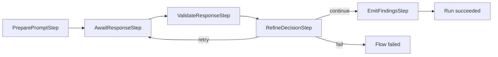
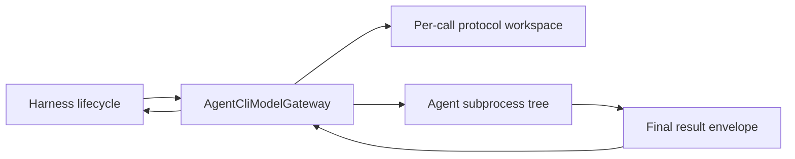

# Architecture

This document describes the current implementation. Historical sketches live
under [`archive/`](archive/).

## System boundary

The dependency direction is one-way:

```text
host application
  -> flower-ai-harness adapters and validators
  -> flower-ai-harness-core
  -> flower-core
```

Core has no compile dependency on:

- Spring or Spring AI;
- Jackson;
- OpenAI or Anthropic SDKs;
- any host application;
- any persistence implementation.

Those dependencies live in separate adapter modules.

## Primary abstractions

| Concern | Main types |
| --- | --- |
| Request and response | `AiModelRequest`, `AiModelResponse`, `ModelId`, `ProviderOptions` |
| Asynchronous provider port | `AiModelGateway`, `AiModelCall`, `AiModelCallStatus` |
| Prompting | `PromptBuilder`, `RenderedPrompt`, `PromptVersion`, `PromptTemplate` |
| Validation | `AiSchemaValidator`, `ValidationResult`, `ValidationError` |
| Refine and fallback | `AiRefinePolicy`, `RefineDecision`, `MaxAttemptsRefinePolicy`, `ModelFallbackRefinePolicy` |
| Findings | `AiFinding`, `FindingExtractor`, `FindingSink` |
| Run state | `AiHarnessRunContext`, `AiHarnessRunSnapshot`, `AiHarnessRunStore` |
| Operational control | `AiCancellationToken`, `AiBudgetPolicy`, `AiResourceGovernor` |
| Recovery | `AiRecoveryPolicy`, `AiRecoveryDecision` |
| Assembly | `AiHarnessSpec`, `AiHarnessFlowFactory`, `AiHarnessFlow` |
| Observation | `TraceListener`, `AiHarnessClock` |

## Construction model

A host builds one immutable `AiHarnessSpec<I, T>` for each harness type and
reuses it across runs.

The spec contains:

- harness identity and prompt version;
- default model, provider options, and timeout;
- `PromptBuilder<I>`;
- `AiSchemaValidator<T>`;
- refine, budget, and resource policies;
- run store;
- `FindingExtractor<T>` and `FindingSink`;
- trace listeners.

`AiHarnessFlowFactory<I, T>` combines a spec, gateway, and clock. Each
`createFlow(...)` call creates:

- a new `AiHarnessRunId`;
- a new mutable `AiHarnessRunContext`;
- a fixed Flower flow graph;
- an `AiHarnessFlow` wrapper containing both flow and context.

The host submits `aiHarnessFlow.flow()` to Flower and uses
`aiHarnessFlow.context()` for correlation and inspection.

## Execution lifecycle

The graph contains five package-private steps:



### 1. Prepare prompt

`PreparePromptStep`:

1. marks the run `PREPARING_PROMPT`;
2. emits `onRunStarted`;
3. calls the host `PromptBuilder`;
4. creates the initial `AiModelRequest`;
5. marks the run `QUEUED`.

Prompt-building failures fail the run immediately.

### 2. Submit and await provider work

`AwaitResponseStep.onEnter()` resets its local submission state and marks the
run `QUEUED`.

On the first tick, it:

1. checks the per-run cancellation token;
2. evaluates `AiBudgetPolicy`;
3. attempts to acquire an `AiResourcePermit`;
4. calls `AiModelGateway.submit(request)`;
5. records the returned `AiModelCall`;
6. increments the attempt count;
7. marks the run `WAITING_PROVIDER`;
8. returns `stay()`.

If no resource permit is available, the step returns `stay()` without
submitting or incrementing the attempt count.

On later ticks, it polls the call:

| Call status | Harness behavior |
| --- | --- |
| `PENDING` | Return `stay()`. |
| `READY` | Read and record the response, release the resource permit, continue. |
| `FAILED` | Record the error, release the permit, continue to refine decision. |
| `CANCELLED` | Mark the harness run cancelled and fail the Flower flow. |

Submission failures are also recorded as call errors and count as attempts, so
the refine policy can decide whether to retry.

### 3. Validate

`ValidateResponseStep` skips validation when the latest attempt has a call
error. Otherwise it:

1. marks the run `VALIDATING`;
2. passes the raw `AiModelResponse` to `AiSchemaValidator<T>`;
3. records `ValidationResult.Valid<T>` or `ValidationResult.Invalid<T>`.

An invalid result is normal lifecycle data and proceeds to the refine policy.
An exception thrown by the validator fails the run.

### 4. Refine or continue

`RefineDecisionStep` builds a `RefineContext` containing:

- the current run context;
- last request;
- latest response, if any;
- latest validation, if any;
- call error, if any;
- current and maximum attempts.

The policy returns:

- `Continue`: proceed to finding emission;
- `Retry(nextRequest)`: replace the current request and jump back to
  `AwaitResponseStep`;
- `Fail(reason)`: fail the run.

The flow graph is static. Retry is a backward transition, not runtime graph
mutation.

### 5. Emit findings

`EmitFindingsStep` requires a valid structured result. It:

1. marks the run `EMITTING_FINDINGS`;
2. maps the typed value through `FindingExtractor<T>`;
3. records the generic findings;
4. calls the host `FindingSink`;
5. marks the run `SUCCEEDED`;
6. emits `onRunCompleted`.

`FindingSink` runs synchronously on the Flower worker tick. It must enqueue or
perform a fast in-memory action rather than block on database or network I/O.
A sink exception fails the run.

## Non-blocking model

Flower workers are tick-driven, so the provider contract is deliberately a
polling handle:

```java
AiModelCall call = gateway.submit(request);
AiModelCallStatus status = call.poll();
```

Rules:

1. `submit()` returns promptly after scheduling or initiating work.
2. `poll()` performs no blocking wait.
3. `result()` is called only after `READY`.
4. `error()` is used after `FAILED`.
5. `cancel()` is best-effort and should propagate to underlying work where
   possible.
6. Provider modules own executors, HTTP clients, process management, and
   transport-level timeout enforcement.
7. Core steps never sleep or perform network/process waits.

The request timeout is part of the provider contract. Providers must still
configure their underlying client or execution mechanism so that a timed-out
handle does not leave uncontrolled work behind.

## State and persistence

`AiHarnessRunContext` is the shared mutable state for one flow. Internal steps
use it to carry:

- run and harness identity;
- prompt version;
- status and attempt count;
- current request and call;
- latest response, validation, error, and findings;
- terminal reason;
- cancellation token;
- typed host attributes.

The harness persists state through `AiHarnessRunStore` at lifecycle
transitions. Core supplies:

- a no-op store;
- `InMemoryAiHarnessRunStore`.

Database-backed storage belongs in a host application or optional adapter.

## Flower checkpoint versus harness snapshot

These are separate concerns:

```text
Flower checkpoint
  flow position and Flower recovery state

AiHarnessRunSnapshot
  harness status, attempt, current request, call id,
  latest response, prompt version, terminal reason

Host persistence
  business request, tenant, domain output, audit, UI state
```

An `AiModelCall` is process-local and provider-specific. It is not serialized
into a snapshot.

## Recovery semantics

`AiHarnessFlowFactory.createRecoveredFlow(...)` restores a run context from a
snapshot and asks `AiRecoveryPolicy` for one of four decisions:

- retry the current request;
- continue from the reconstructed flow, currently equivalent to retry when a
  request exists;
- fail recoverably;
- mark cancelled.

The built-in conservative policy is at-least-once. It can resubmit a request
that reached the provider before a crash and therefore can duplicate cost or
side effects.

Hosts with expensive or non-idempotent work should supply a policy that fails
recoverably or requires manual review.

## Operational controls

### Cancellation

Cancellation is per run through `RunOverrides.cancellationToken`. When
requested during provider wait, the step calls `AiModelCall.cancel()`, marks
the run `CANCELLED`, persists state, and terminates the flow.

### Budget

`AiBudgetPolicy` runs before each submission. The included
`MaxAttemptsBudgetPolicy` limits repeated provider execution.

### Resource governance

`AiResourceGovernor.tryAcquire(...)` is non-blocking. The included
`SemaphoreAiResourceGovernor` provides in-JVM concurrency control. A permit is
held while the call is pending and released on response, failure,
cancellation, or step exit.

Provider-specific quotas and distributed rate limits remain outside core.

## External agent process adapter

`flower-ai-harness-provider-agent-cli` implements the same asynchronous
gateway contract for Codex, Claude, or custom subprocess runners.

Submission schedules filesystem and process work on virtual threads. Each
call receives an isolated protocol workspace, and Flower ticks only observe
the in-memory `AiModelCall` state.



The runner's tool loop remains opaque to core. stdout progress is
observational; the result file determines the final response. Timeout,
cancellation, and gateway shutdown terminate the process tree.

See [`AGENT_CLI_PROVIDER.md`](AGENT_CLI_PROVIDER.md).

## Observability

`TraceListener` receives passive callbacks for run start, submission, response,
call failure, validation, refine, completion, cancellation, and run failure.

Trace listener exceptions are ignored so observation cannot change workflow
outcome. Listeners still run synchronously and should return quickly.

`AiModelResponse.ResponseMetadata.providerTrace` carries small
provider-specific string metadata without introducing vendor types into core.

## Provider extension

A provider module:

1. implements `AiModelGateway`;
2. maps `ModelId.name()` and supported `ProviderOptions`;
3. starts asynchronous work and returns an `AiModelCall`;
4. maps final output into `AiModelResponse.rawText`;
5. records useful metadata;
6. propagates timeout and cancellation;
7. supplies deterministic offline tests.

`RoutingAiModelGateway` dispatches by `ModelId.provider()`, allowing different
providers or fallback models in one application.

The external-agent provider follows this same extension point. Agent tool
loops and authentication remain behind an external runner; core still sees
one asynchronous request and one final output.

## Known limitations

- complete responses only; no token streaming;
- no tool/function-call lifecycle in core;
- no multi-agent handoff model;
- no durable provider-call reattachment;
- no exactly-once recovery;
- no distributed resource governor;
- no database-backed store in this repository;
- no built-in prompt registry, RAG, or evaluation platform;
- `FindingSink` and listeners are synchronous callback boundaries.

## Architectural invariants

Every change should preserve:

1. no vendor or framework dependency in core beyond Flower;
2. no host-domain type in public core APIs;
3. no blocking Flower step;
4. one `AiHarnessRunContext` per run;
5. package-private lifecycle steps;
6. provider, validation, refine, and finding concerns remain separable;
7. fake-provider support remains capable of exercising lifecycle behavior;
8. new providers require no core change;
9. maintained docs are updated with behavior changes.
