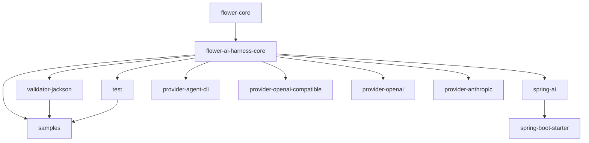

# Module catalog

All modules share the reactor version from the parent POM. The current
development version is `0.1.1-SNAPSHOT`; the latest repository release tag is
`v0.1.0`.

## Reactor overview

| Module | Role | Main compile dependencies |
| --- | --- | --- |
| `flower-ai-harness-core` | Provider-neutral lifecycle, policies, state, flow assembly. | Flower core |
| `flower-ai-harness-validator-jackson` | JSON-to-POJO structured output validator. | core, Jackson |
| `flower-ai-harness-test` | Fake provider, deterministic clock, assertions, JUnit helper. | core, JUnit API, AssertJ |
| `flower-ai-harness-spring-ai` | Spring AI `ChatClient`/`ChatModel` gateway adapter. | core, Spring AI |
| `flower-ai-harness-provider-agent-cli` | Vendor-neutral external agent subprocess adapter. | core, Jackson |
| `flower-ai-harness-provider-openai-compatible` | Raw HTTP `/chat/completions` adapter. | core, Jackson |
| `flower-ai-harness-provider-openai` | Official OpenAI Java SDK adapter. | core, OpenAI SDK |
| `flower-ai-harness-provider-anthropic` | Official Anthropic Java SDK adapter. | core, Anthropic SDK |
| `flower-ai-harness-spring-boot-starter` | Thin Spring Boot auto-configuration for the Spring AI gateway. | spring-ai adapter, Spring Boot autoconfigure |
| `flower-ai-harness-samples` | Domain-neutral text review sample and lifecycle tests. | core, validator-jackson, test |

The samples module participates in CI but is skipped during deployment.

## Dependency graph



The arrows mean “is required by the target module” in the diagram above. Core
does not depend on any adapter module.

## `flower-ai-harness-core`

Purpose:

- define the stable provider-neutral lifecycle;
- assemble internal Flower steps;
- expose policies and host integration seams;
- remain dependency-light.

Package map:

| Package | Responsibility |
| --- | --- |
| `control` | Cancellation, budget, resource permits, concurrency governor. |
| `finding` | Generic findings, extraction, publication. |
| `flow` | Public flow factory/wrapper and package-private lifecycle steps. |
| `gateway` | Gateway interface, routing gateway, gateway exception. |
| `model` | Request, response, call handle, model ID, provider options. |
| `prompt` | Prompt identity, messages, and host prompt builder. |
| `recovery` | Snapshot recovery context, decisions, and policy. |
| `refine` | Retry/refine decisions and fallback policies. |
| `run` | Run context, status, snapshots, and stores. |
| `spec` | Immutable harness specification. |
| `spi` | Clock and trace listener. |
| `validate` | Structured validation contracts. |

Key entry points:

- `AiHarnessSpec<I, T>`;
- `AiHarnessFlowFactory<I, T>`;
- `AiModelGateway`;
- `RoutingAiModelGateway`.

Core tests cover value contracts, routing, operational controls, recovery,
flow construction, and refine policies.

## `flower-ai-harness-validator-jackson`

Public API:

- `JacksonPojoSchemaValidator<T>`.

It parses `AiModelResponse.rawText()` with a supplied `ObjectMapper` and target
class. Domain-specific semantic validation can wrap or replace it through the
core `AiSchemaValidator<T>` interface.

Use it when the expected model output is JSON that maps naturally to a Java
type.

## `flower-ai-harness-test`

Public test support:

- `FakeAiModelGateway`;
- `FakeResponseProgram`;
- `RequestMatcher`;
- `RecordedCall`;
- `FixedAiHarnessClock`;
- `AiFindingAssertions`;
- `AiHarnessRunAssertions`;
- `AiHarnessTestExtension`.

The fake gateway supports immediate, delayed, failing, and sequenced responses,
which makes validation/refine/fallback behavior deterministic.

This module is intended as a test dependency for host applications.

## `flower-ai-harness-spring-ai`

Public API:

- `SpringAiModelGateway`;
- `SpringAiModelResolver`.

The resolver maps a harness `ModelId` to the Spring AI model/client used for a
call. The gateway performs work on an executor and exposes it through
`AiModelCall`.

Use this module in Spring applications that already use Spring AI or need
Spring-managed provider integration.

## `flower-ai-harness-provider-openai-compatible`

Public API:

- `OpenAiCompatibleModelGateway`;
- `OpenAiCompatibleGatewayConfig`;
- `OpenAiCompatibleOptions`.

It calls an OpenAI-compatible `/chat/completions` endpoint directly using the
JDK HTTP client and Jackson mapping.

Use it for compatible proxies, local gateways, or hosted services where the
official OpenAI SDK is not the desired integration layer.

## `flower-ai-harness-provider-agent-cli`

Public API:

- `AgentCliModelGateway`;
- `AgentCliGatewayConfig`;
- `AgentCliEnvironmentPolicy`;
- `AgentCliOptions`;
- progress event/listener types;
- structured execution, timeout, and protocol exceptions.

It writes a versioned request into an isolated call workspace, executes an
external process asynchronously, drains logs and progress, enforces timeout
and process-tree cancellation, and maps the final result envelope into
`AiModelResponse`.

Use it for Codex SDK, Claude Agent SDK, installed CLI, or custom agent runners
that own an inner tool loop. The module itself contains no vendor SDK.

See [`AGENT_CLI_PROVIDER.md`](AGENT_CLI_PROVIDER.md).

## `flower-ai-harness-provider-openai`

Public API:

- `OpenAiModelGateway`;
- `OpenAiGatewayConfig`;
- `OpenAiOptions`.

It maps harness requests to the official OpenAI Java SDK chat completion API.

Use it when an application wants direct OpenAI SDK integration without Spring
AI.

## `flower-ai-harness-provider-anthropic`

Public API:

- `AnthropicModelGateway`;
- `AnthropicGatewayConfig`;
- `AnthropicOptions`.

It maps role-tagged prompts to the official Anthropic Messages API and returns
the final text response plus provider metadata.

Use it when an application wants direct Anthropic SDK integration without
Spring AI.

## `flower-ai-harness-spring-boot-starter`

Public configuration types:

- `FlowerAiHarnessSpringAiAutoConfiguration`;
- `FlowerAiHarnessSpringAiProperties`.

The starter is intentionally thin. It can provide:

- a dedicated model executor;
- a default resolver when a single suitable Spring AI client is available;
- a `SpringAiModelGateway` when the host has not defined its own gateway.

It does not create domain harness specs, prompt builders, validators, finding
sinks, or persistence.

## `flower-ai-harness-samples`

The text review sample demonstrates:

- prompt construction;
- Jackson validation;
- finding extraction;
- fake-provider execution;
- malformed-output refine and retry;
- provider error retry;
- model fallback;
- terminal failure.

Main class:

```text
io.github.flowerjvm.flower.ai.harness.samples.textreview.TextReviewSampleApplication
```

See [`../flower-ai-harness-samples/README.md`](../flower-ai-harness-samples/README.md).

## Choosing dependencies

Minimal core usage:

```xml
<dependency>
  <groupId>io.github.flowerjvm</groupId>
  <artifactId>flower-ai-harness-core</artifactId>
  <version>${flower-ai-harness.version}</version>
</dependency>
```

Common structured-output usage adds:

```xml
<dependency>
  <groupId>io.github.flowerjvm</groupId>
  <artifactId>flower-ai-harness-validator-jackson</artifactId>
  <version>${flower-ai-harness.version}</version>
</dependency>
```

Tests add:

```xml
<dependency>
  <groupId>io.github.flowerjvm</groupId>
  <artifactId>flower-ai-harness-test</artifactId>
  <version>${flower-ai-harness.version}</version>
  <scope>test</scope>
</dependency>
```

Then choose one production gateway:

- Spring AI adapter;
- external agent CLI/subprocess adapter;
- OpenAI-compatible HTTP;
- official OpenAI SDK;
- official Anthropic SDK;
- a host-defined `AiModelGateway`.

## Adding a module

A new module must:

1. depend on core rather than duplicate lifecycle logic;
2. stay vendor- or technology-specific outside core;
3. use the shared reactor version;
4. appear in parent modules and dependency management;
5. include offline deterministic tests;
6. be documented here and in the root README;
7. have an explicit deployment decision;
8. preserve Java 21 and repository checkstyle rules.
